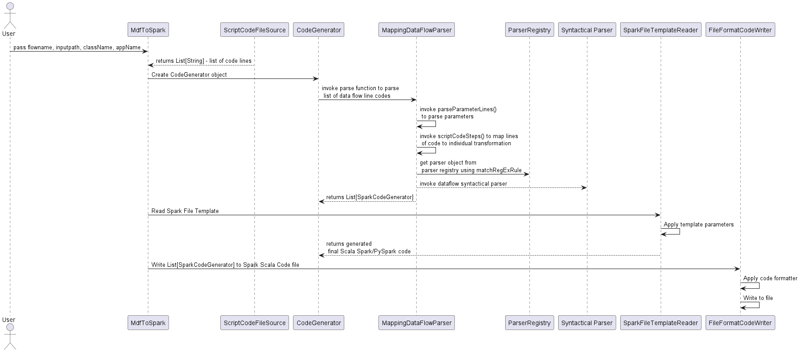

# Mapping Data Flow to Microsoft Fabric

Fast and Easy to
convert [Mapping data flows](https://learn.microsoft.com/en-us/azure/data-factory/concepts-data-flow-overview) from
Azure Data Factory to [Microsoft Fabric](https://learn.microsoft.com/en-us/fabric/) [Notebook](https://learn.microsoft.com/en-us/fabric/data-engineering/how-to-use-notebook) and [Spark Job](https://learn.microsoft.com/en-us/fabric/data-engineering/create-spark-job-definition).

## Contents

- Overview 
- Extendability
- Installation
    - Pre-Prerequisite
    - Execution
- Usage
- Example
- Limitations

## Overview

The Mapping data flow to Microsoft Fabric notebook is a command line tool to convert Mapping data flow script code to Spark Scala and PySpark code. The
objective of the conversion tool is to provide the Spark code in the following format:

1. PySpark Script
2. Scala Spark Object
3. Microsoft Fabric PySpark Notebook
4. Microsoft Fabric Scala Spark Notebook

## Design Approach

The tool is composed of following logical components:

1. Syntactical Parsers
2. Dataflow Spark data structures (model classes)
3. Code templates - to generate the spark code in File format
4. File and Notebook writer

The syntactical parsers parse the MDF (mapping dataflow) script code to Spark code. These parsers are built
using [Scala Parser Combinators](https://github.com/scala/scala-parser-combinators). These parsers are made out of scala
functions, which convert a stream of input tokens into a data structure to generate spark code. That means parsing rules
are written in Scala; that means anyone familiar with Scala or Java can write these tiny parsers and using a combinator
to create complex parsers.

The parser combinator approach helps to combine multiple parser functions to provide a composed parser function. The
parser combinator functions are capable of generating an abstract syntax tree (AST) representing the parse, which the
application can easily consume. In Scala, we can define an AST to use a hierarchy of case classes (model classes) with
an abstract class at the top. For example AST for the MDF row
modifier ```dimcity filter(StateProvince==$StateFilter1 || StateProvince==$StateFilter2) ~> cityfilter``` will be:

```
DataFlowFilter(dimcity,ListExpressionCondition(List(ExpressionCondition(List(StateProvince),==,List(StateFilter1),||), ExpressionCondition(List(StateProvince),==,List(StateFilter2),))),cityfilter)
```

A transformation from the transformation flow is parsed using spark parser like Source, Filter, Join, etc.
Transformation parsers are loaded
using [Service loader](https://docs.oracle.com/javase/8/docs/api/java/util/ServiceLoader.html) pattern. The following
diagram depicts relationship of parsers with other combinators.


The mdf-to-spark execution flow is as following:



## Extendability

### Adding/extending a new parser

AA new parser class must extend from `BaseStandardTokenParser` and make an entry into the service loader (
META-INF/services) to leverage it the same at runtime processing.

### Code Template

Code templates for Scala and PySpark are defined in `resources/code/filetemplate`; placeholders are passed along with
the template arguments array to generate the spark code.

### Output Writer

The tool provides two output formats using `FileFormatCodeWriter` and `NbFormatWriter`

2. File - Scala Spark and PySpark
3. Notebook Format - Scala and PySpark

The output of the Code Template is input for the File writer. The Notebook metadata are configured
using `resources/code/notebookmetadata` and written using python [nbformat package](https://pypi.org/project/nbformat/).

### Source of MDF Script Code


## Installation

**Pre-Prerequisite**

- [Java 11](https://learn.microsoft.com/en-us/java/openjdk/download#openjdk-11) 
- [SBT 1.9.3](https://www.scala-sbt.org/download.html) (only if you want to build from source)
- [Scala 2.12.11](https://www.scala-lang.org/download/2.12.11.html) (only if you want to build from source)
- [Python 3.10.11](https://www.python.org/downloads/release/python-31011/)

**Nbformat Installation**

The tool uses  [nbformat package](https://pypi.org/project/nbformat/) to create Notebook and jep to execute Python
modules from Java. You need to run the following commands to install jep and nbformat.

```
pip install jep
pip install nbformat
```

## Usage

The entry point for the tool is `com.microsoft.azure.adf.tool.MdfToSpark`; the tool can read MDF script code from a file
and [DataFlow REST API](https://learn.microsoft.com/en-us/rest/api/datafactory/data-flows/get?tabs=HTTP)

Converting Script code from the file to the Spark code would require the following program arguments:
- `--inputpath` - absolute script code path (including file name)
- `--className` - output Spark and PySpark file name
- `--appName` - Spark job name
- `--source File`

`java -Djava.library.path=C:\Python310\Lib\site-packages\jep -jar mdf-to-spark-assembly-0.1.jar --source file  --flowname <flowname> --inputpath <scriptcode file path> --className <output scala class> --appName <spark job name>`

Reading script code using REST API and converting it to the Spark code would require the following program arguments 
and need to provide AZURE_SUBSCRIPTION_ID environment variable:
- `--rg` - Resource group
- `--factoryName` - Factory name
- `--dataFlowName` - Data Flow name
- `--className` - output Spark and PySpark file name
- `--appName` - Spark job name
- `--source API`

`java  -Djava.library.path=<<path of python3>>\site-packages\jep -jar mdf-to-spark-assembly-<version>.jar com.microsoft.azure.adf.tool.MdfToSpark  --source api --rg <resource group> --factoryName <adf name> --dataFlowName <dataFlowName> --className <output scala class> --appName <spark job name>`

## Limitations

The current tools supports **limited set of properties** for the following mapping data flow transformations:

- Source
- Select Column Mapping
- Join
- Union
- Filter
- Sink
- Sort